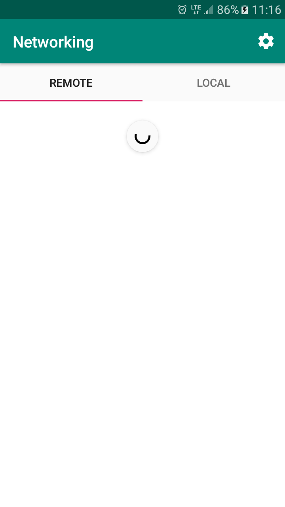
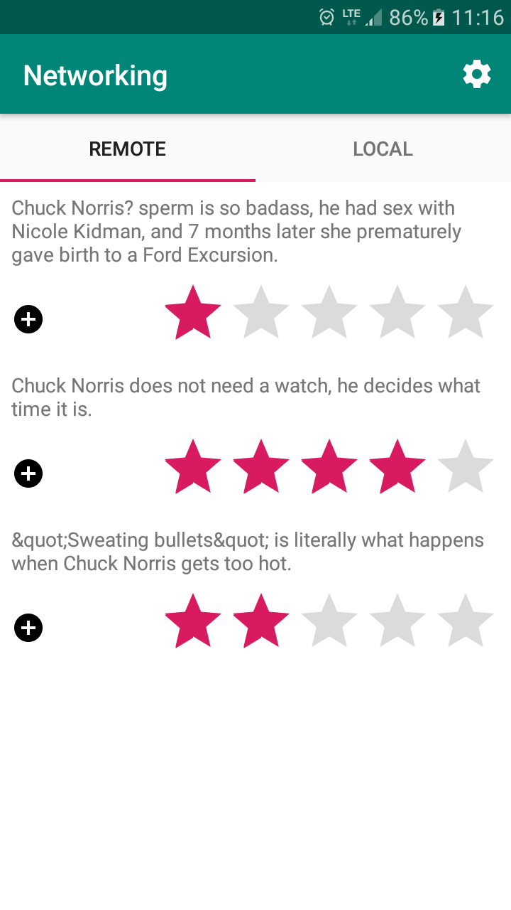
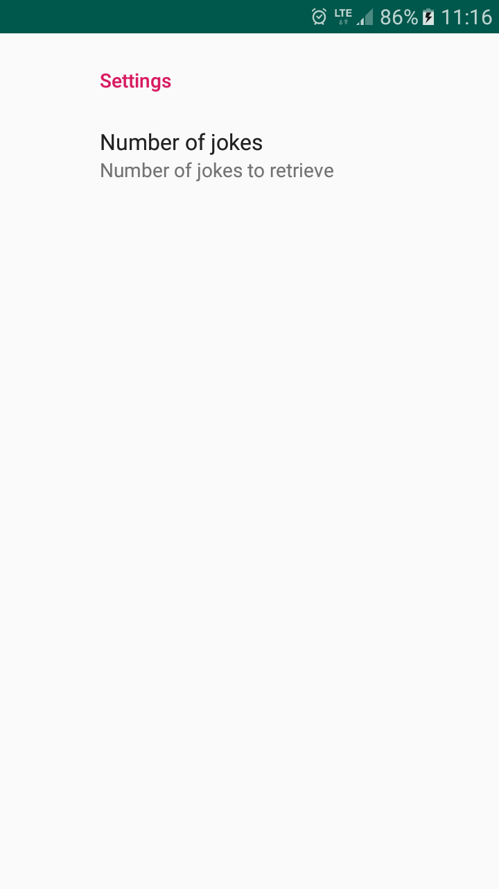

## Networking ##

Create application that (1) **connects** to remote server serving jokes, (2) **downloads** them and (3) **insert** them to local database if required. User should be able to (4) **rate** jokes and (5) **display** collection of jokes that have been added to database, sorted by rating.

**Requirements**

* Server documentation: http://www.icndb.com/api/
* Server REST API: https://api.icndb.com
* Application contains two views
    * First for loading jokes from the server
    * Second for showing jokes that have been added to database
* User can **download** / **refresh** jokes by swiping finger down, using `SwipeRefrehLayout`
* Once jokes are retrieved, they should be displayed in `RecyclerView` and allow user to **rate** them (0-5) and **add** them to database
* User can review jokes that have been added to database using `RecyclerView`, sorted by rating.
* User can define number of jokes to download in **Settings** screen

**Sample screenshots**

